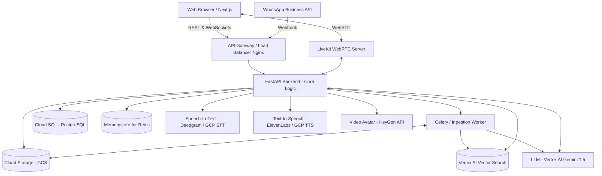
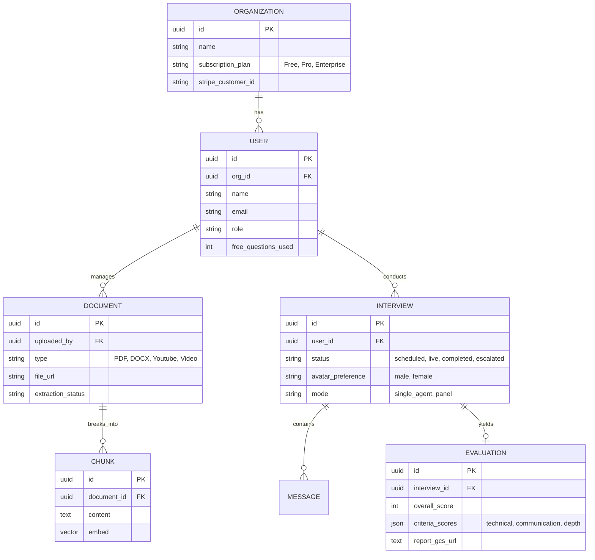

# PanelMind AI – System Architecture & Implementation Plan

## 1. System Architecture Diagram



## 2. Low-Latency Interview Streaming Architecture

Achieving an end-to-end latency of ~2 seconds requires skipping traditional request-response loops in favor of bidirectional streams.

*   **Communication Layer:** LiveKit or Daily (WebRTC) to handle audio/video without HLS lag, providing sub-millisecond connection delays.
*   **Speech-to-Text (STT):** Deepgram Streaming API (for lowest latency) or GCP Speech-to-Text V2 connected via WebSockets. It acts instantly on user audio packets.
*   **Intelligence:** Vertex AI Gemini 1.5 Flash, configured with `stream=True` to minimize time-to-first-token.
*   **Semantic Caching:** Memorystore for Redis caches common questions and pre-generated contextual responses.
*   **Text-to-Speech (TTS):** ElevenLabs WebSocket. It processes text streams immediately after the first chunks from the LLM arrive.
*   **Visual Avatar:** HeyGen / D-ID Streaming API. This sits behind LiveKit, directly ingesting the TTS output and streaming its visual mouth movements back natively as a WebRTC video track.

## 3. Database Schema



## 4. API Specification

### Core APIs (REST via FastAPI)
*   **Auth:** `POST /api/v1/auth/login` | `POST /api/v1/auth/register` (JWT tokens).
*   **Knowledge Base:** 
    *   `POST /api/v1/knowledge/upload` - Multipart upload directly returning a Job tracking ID.
    *   `GET /api/v1/knowledge/status/{job_id}` - Polling endpoint for extraction/embedding progress.
*   **Interviews:**
    *   `POST /api/v1/interview/prepare` - Pre-warms models, pre-generates 20 questions contextually, and returns a LiveKit `room_token`.
    *   `POST /api/v1/interview/{id}/escalate` - Interrupts AI and routes WebSocket feed to human HR dashboard.
    *   `GET /api/v1/interview/{id}/report` - Fetches evaluation (PDF or JSON).
*   **Billing (SaaS):**
    *   `POST /api/v1/billing/webhook` - Standard Stripe webhook (Subscription upgrades, free->paid state updates).

### Streaming & Realtime
*   **Chatbot:** `WSS /ws/chat` - Real-time text interface. Returns answers + references (PDF links, PPT summaries).
*   **Orchestrator:** `WSS /ws/interview/{room_id}` - Central backend orchestrator linking the user's LiveKit STT stream to the AI Agents.

## 5. GitHub Repository Structure

```text
panelmind-ai/
├── frontend/                 # Next.js 14 App Router Framework
│   ├── src/
│   │   ├── app/              # Routing pages (Dashboard, Interview Room)
│   │   ├── components/
│   │   │   ├── webRTC/       # LiveKit video grid and audio components
│   │   │   └── dashboard/    # Knowledge upload drag&drop, Analytics UI
│   │   └── lib/              # API hooks, state mgmt (Zustand/Context)
├── backend/                  # Python FastAPI Microservices
│   ├── app/
│   │   ├── api/              # API endpoints and Websocket logic
│   │   ├── models/           # SQLAlchemy DB models
│   │   └── services/
│   │       ├── rag_engine/   # LlamaIndex / LangChain document splitters
│   │       ├── speech_stt/   # Deepgram streaming wrappers
│   │       └── agents/       # Multi-agent crew logic (HR, Tech)
│   ├── workers/              # Celery Async workers for OCR / Ingestion
│   └── requirements.txt
├── infra/                    # Kubernetes & Cloud Orchestration
│   ├── k8s/                  # Deployments, Services, Ingress rules
│   └── terraform/            # Base GCP infra provisioning
└── docker-compose.yml        # Seamless local testing environment
```

## 6. AI Pipelines

### Knowledge Base Ingestion Pipeline (RAG)
1.  **Extractors:** Triggered via background workers. Uses `Whisper` or Vertex AI endpoints for audio/video, `Document AI` or Gemini 1.5 Pro Vision for images, and `PyMuPDF` for documents.
2.  **Chunking:** Use LangChain semantic chunking (`RecursiveCharacterTextSplitter`) overlapping to maintain context.
3.  **Embedding:** Vertex AI Embeddings API (`text-embedding-004`) vectorizes chunked texts.
4.  **Storage:** Upsert vectors + metadata (document ID, permissions) into **Vertex AI Vector Search** (or Pinecone via GCP Marketplace).

### Multi-Agent Interview Panel Pipeline
Powered by LangGraph to allow stateful hand-offs:
1.  **Router Node:** Analyzes conversation state to decide which interviewer answers next (e.g. Technical Interviewer vs. HR).
2.  **Specialist Prompts:** Injects real-time RAG retrieved data to ground the agent's questions in company literature.
3.  **Background Evaluator:** A parallel lightweight agent reads the ongoing transcript buffer. When the interview ends, it synthesizes the final grades across configured criteria (depth, clarity) and exports the PDF.

## 7. Deployment Scripts & Infrastructure

**Local Development (`docker-compose.yml`):**
Sets up Postgres, Redis, the FastAPI backend, and Next.js seamlessly.

**Production Deployment:**
*   **Frontend:** Deployed natively on **Google Cloud Run** using Next.js standalone output.
*   **Database:** Fully Managed **Cloud SQL for PostgreSQL**.
*   **WebRTC:** Deployed internally on GKE or leveraging Hosted LiveKit Cloud instances. Real-time media handling is notoriously difficult to scale.
*   **Backend Containers:** Deployed via **Google Kubernetes Engine (GKE)** or **Cloud Run**. Enables HPA (Horizontal Pod Autoscaling) to spin up faster during mass interviews. Background workers on Cloud Run Jobs.

**CI/CD Pipeline (GitHub Actions / Cloud Build):**
1.  `test.yml`: Runs tests, `flake8`, and Next.js builds on every PR.
2.  `deploy.yml`: On push to `main` -> builds Docker images -> Pushes to **Artifact Registry** -> applies `kubectl rollout restart` or creates a new Cloud Run revision.

## 8. Environment Configuration (`.env.example`)

```ini
# Core
ENVIRONMENT=production
SECRET_KEY=super_secure_sha256_hash
DATABASE_URL=postgresql://user:pass@db:5432/panelmind
REDIS_URL=redis://redis:6379/0

# GCP & AI
GOOGLE_APPLICATION_CREDENTIALS=/path/to/service-account.json
GCP_PROJECT_ID=panelmind-prod-1234
DEEPGRAM_API_KEY=dg_...
ELEVENLABS_API_KEY=eleven_...
HEYGEN_API_KEY=heygen_...

# Vector DB
VECTOR_SEARCH_INDEX_ID=projects/123/locations/us-central1/indexes/456
VECTOR_SEARCH_ENDPOINT_ID=projects/123/locations/us-central1/indexEndpoints/789

# WebRTC (LiveKit)
LIVEKIT_API_KEY=devkey
LIVEKIT_API_SECRET=secret
LIVEKIT_URL=wss://panelmind.livekit.cloud
```

## 9. Security Best Practices

1.  **Data Isolation (SaaS):** Implement strict namespace separation in Vertex AI Vector Search utilizing the `organization_id` vector restrict filter. Enable PostgreSQL Row-Level-Security (RLS).
2.  **PII Redaction:** Implement a Microsoft Presidio middleware text scrubber to intercept PII before forwarding responses back into OpenAI logs.
3.  **Billing & Quotas Enforcement:** Rate-limit strictly over Redis. Check the 10 free-question counter *before* initiating any costly TTS/Avater stream generation.
4.  **Audio/Video Stream Auth:** Handshake WebRTC specifically using ephemeral, short-lived tokens, scoped exactly to the single `interview_id` and expiring automatically.

## 10. UI/UX Blueprint & Wireframes

This section outlines the core screens of the PanelMind AI platform.

### A. Main User Dashboard (Web)

**Purpose:** The central hub where HR or managers can see upcoming interviews, upload knowledge, and review past performance.

```text
+--------------------------------------------------------------------------------+
|  [Logo] PanelMind              Search Interviews...        [User] [Settings]   |
+-------------------------+------------------------------------------------------+
|                         |                                                      |
|  [+] New Interview      |  Welcome back, Sarah! (HR Tech Lead)                 |
|                         |                                                      |
|  [ ] Dashboard          |  +-----------------------+ +-----------------------+ |
|  [ ] Knowledge Base     |  | Total Interviews (30) | | Knowledge Docs (12)   | |
|  [ ] Candidates         |  +-----------------------+ +-----------------------+ |
|  [ ] Analytics          |                                                      |
|  [ ] Billing            |  [Recent Interviews]                                 |
|                         |  +-------------------------------------------------+ |
|                         |  | John Doe    | SDE 2   | 85/100  | [View Report] | |
|                         |  | Jane Smith  | PM      | Pending | [Join Live]   | |
|                         |  | Alex Chen   | Backend | 92/100  | [View Report] | |
|                         |  +-------------------------------------------------+ |
|                         |                                                      |
|                         |  [Active Knowledge Processing]                       |
|                         |  - "Engineering_Guidelines.pdf" (Extracting... 45%)  |
+-------------------------+------------------------------------------------------+
```

### B. Knowledge Base Upload Modal

**Purpose:** Simple interface to feed the RAG engine with PDFs, docs, or web links to ground the AI's knowledge for specific interviews.

```text
+------------------------------------------------------+
|                 Upload Knowledge                     |
|                                                      |
|  Upload documents, guidelines, or provide URLs       |
|  so the AI Panel can ask context-aware questions.    |
|                                                      |
|  +------------------------------------------------+  |
|  |                                                |  |
|  |     [☁️] Drag & Drop Files Here                |  |
|  |          or click to browse                    |  |
|  |     (PDF, DOCX, TXT - Max 50MB)                |  |
|  |                                                |  |
|  +------------------------------------------------+  |
|                                                      |
|  Or provide a URL:                                   |
|  [ https://company.com/engineering-values       ]    |
|                                                      |
|  [Cancel]                                 [Upload]   |
+------------------------------------------------------+
```

### C. Live AI Interview Room (Candidate View)

**Purpose:** A clean, low-latency WebRTC room where the candidate interacts directly with the AI Avatar. Minimal distractions.

```text
+--------------------------------------------------------------------------------+
|  PanelMind Interview: Senior Backend Engineer          [00:15:30] [Need Help?] |
+--------------------------------------------------------------------------------+
|                                                                                |
|          +---------------------------------------------------------+           |
|          |                                                         |           |
|          |                                                         |           |
|          |                 [ AI AVATAR VIDEO ]                     |           |
|          |                                                         |           |
|          |                                                         |           |
|          |       "Could you explain the difference between         |           |
|          |        optimistic and pessimistic locking?"             |           |
|          |                                                         |           |
|          +---------------------------------------------------------+           |
|                                                                                |
|      +-----------------------+                                                 |
|      |                       |       [   ] Mute Audio                          |
|      | [ CANDIDATE VIDEO ]   |       [   ] Stop Video                          |
|      |                       |                                                 |
|      +-----------------------+       [End Interview (Red)]                     |
|                                                                                |
+--------------------------------------------------------------------------------+
|  Real-time Transcript:                                              [Hide ^]   |
|  AI: "Welcome to the interview! Let's start with your database experience."    |
|  You: "Sure, I've worked extensively with PostgreSQL and Redis..."             |
+--------------------------------------------------------------------------------+
```

### D. HR "Live Escalate" / Over-the-Shoulder View

**Purpose:** Allows a human recruiter/engineer to silently watch the AI conduct the interview, read the real-time AI logic, and optionally take over ("Escalate").

```text
+--------------------------------------------------------------------------------+
|  [Live Spectator] Candidate: John Doe (SDE 2)                 [Take Over 🔴]   |
+-------------------------+------------------------------------------------------+
|                         |                                                      |
|  +-------------------+  | [Live Transcript Box]                                |
|  | [AI AVATAR]       |  | Candidate: "...so I used a Redis cache."             |
|  +-------------------+  | AI: "Interesting. How did you handle cache           |
|                         |      invalidations?"                                 |
|  +-------------------+  |                                                      |
|  | [CANDIDATE]       |  | [AI Inner Monologue / Reasoning]                     |
|  +-------------------+  | > RAG hit: Redis documentation matched.              |
|                         | > Evaluating previous answer: 8/10 technical depth.  |
|                         | > Next strategic move: Probe consistency models.     |
|                         |                                                      |
|                         | [Suggested Follow-up Questions for HR]               |
|                         | - "Ask about Thundering Herd problem" [Inject]       |
|                         | - "Ask about Redis cluster scaling"   [Inject]       |
|                         |                                                      |
+-------------------------+------------------------------------------------------+
```

### E. AI Evaluation Report (Post-Interview)

**Purpose:** The final output generated by the `Background Evaluator` agent, summarizing the candidate's performance.

```text
+--------------------------------------------------------------------------------+
|  Interview Report: John Doe                                     [Export PDF]   |
+--------------------------------------------------------------------------------+
|                                                                                |
|  Role: SDE 2                                 Overall Score: 85 / 100           |
|  Date: Oct 26, 2026                          Decision: Proceed to Onsite       |
|                                                                                |
|  [ Score Breakdown ]                                                           |
|  - Technical Depth: 88/100                                                     |
|  - Communication:   82/100                                                     |
|  - Culture Fit:     90/100 (Based on engineering values RAG match)             |
|                                                                                |
|  [ Strengths ]                                                                 |
|  ✅ Strong understanding of distributed caching (Redis).                       |
|  ✅ Clear communication when explaining complex architectures.                 |
|                                                                                |
|  [ Areas for Improvement ]                                                     |
|  ⚠️ Struggled slightly with specific Kubernetes scaling mechanics.             |
|                                                                                |
|  [ Transcript Snippets - Read More... ]                                        |
+--------------------------------------------------------------------------------+
```
